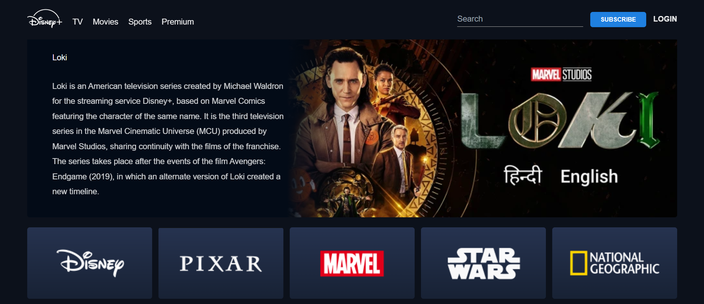
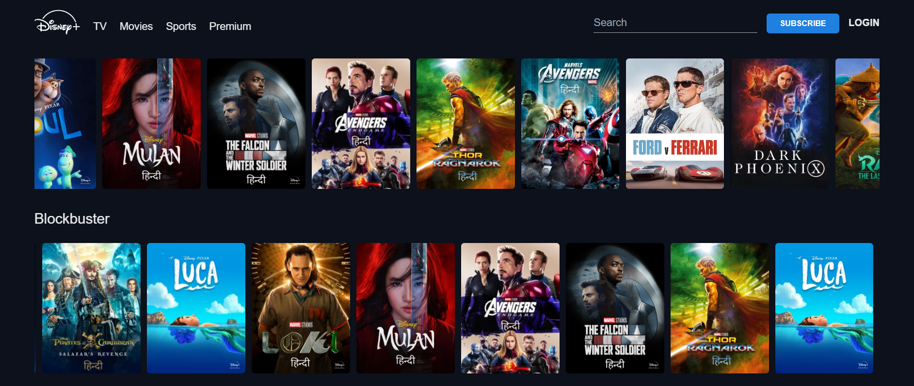

# Disney Plus Hotstar Clone

## Project Overview
This project is a clone of Disney Plus Hotstar, implemented using HTML, CSS, and JavaScript. It aims to replicate the core functionalities and user interface of the popular streaming service.

## Features
- **`User Authentication`**: Sign up and log in functionality for users.
- **`Content Streaming`**: Browse and stream movies and TV shows.
- **`Search and Filtering`**: Search for content and apply filters based on genres, languages, etc.
- **`Responsive Design`**: Ensures a seamless viewing experience across devices.

## Technologies Used
- HTML
- CSS (with Flexbox or Grid for layout)
- JavaScript (ES6+ for interactivity and DOM manipulation)

## Setup Instructions
1. Clone the repository: git clone https://github.com/NavyaAgarwal02/DisneyPlus-Hotstar.git
2. Navigate to the project directory: `cd DisneyPlus-Hotstar`
3. Open the `index.html` file in your web browser to view the application.

## Screenshots

## Live Demo
Check out the live demo [here](https://disneyplus-hotstar-6trsnpg8f-navya-agarwals-projects.vercel.app/#).

## Contributing
Contributions are welcome! Please fork the repository and create a pull request.

